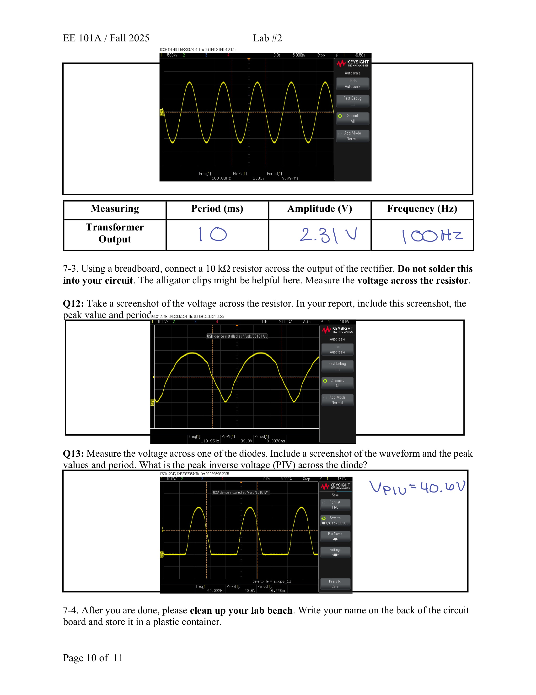

Author: Giselle Ransom
Institution: Stanford University
Course: EE101A – Circuits 1
Semester: Fall 2025

Over the course of a quarter EE 101A has two main lab builds including:
1. AC-DC conveter (5 weeks)
2. Switch Voltage Regulator (1 week)

The AC–DC converter circuit build utilizes a transformer, rectifier, and voltage regulation stage to provide stable DC output from mains supply. In which the project is broken
into four main building stages/Components:
1. Rectifer
   - utilizing a full wave rectifier
2. Capitor & Zener Diode
   - applying a capicitor/zener diode and measuring the change in output voltage
3. Potentiometer
4. Source Follower

The switch voltage regulator build utilizes MOSFETS in order to implement the circuits funcationality.

Tools:
- Digital Multimeter
- Waveform Genorator
- Oscilloscope
- Soldering Iron
  

